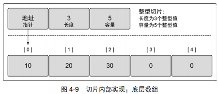
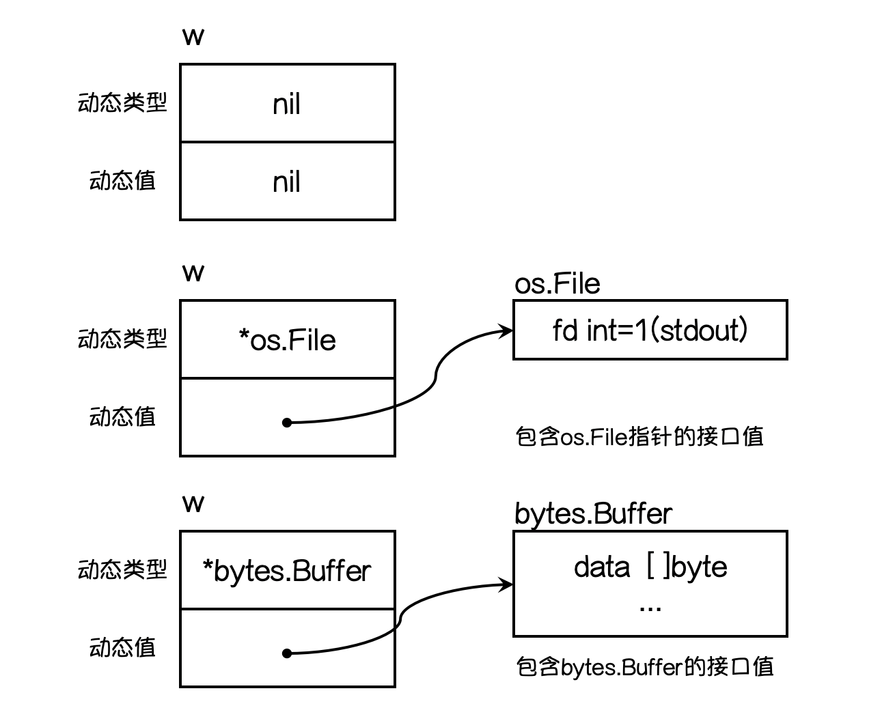

### 《go语言实战 》golang基础复习


#### 切片（slice）

概念: 切片是对底层数组进行了抽象, 并且提供了相关的API方法. 

切片有三个字段: 指向底层数组的指针，切片访问的元素的个数(切片长度)，切片允许的增长元素个数(即容量)




1. 切片的初始化

   1.1 make和切片字面量

   ```golang
   // make 方式创建
   slice := make([]string, 5)  // 长度和容量都是5个元素
   // 切片字面量创建
   slice := []int{10, 20, 30} // 切片长度和容量都是3个元素
   // 使用索引声明切片
   slice := []string{99: ""}   // 使用空字符串初始化第100个元素
   
   // nil 切片 长度和容量都为0
   var slice []int
   
   // 空切片  长度和容量都为0
   slice := make([]int, 0)
   slice := []int{}
   
   ```

   1.2 切片是引用类型，不支持直接比较，只能和nil比较

   ```//golang
   var s1 []int         //len(s1)=0;cap(s1)=0;s1==nil
   s2 := []int{}        //len(s2)=0;cap(s2)=0;s2!=nil
   s3 := make([]int, 0) //len(s3)=0;cap(s3)=0;s3!=nil
   ```

   判断一个切片是否为空，用len(s)==0， 而不是s == nil

   1.3 切片的第三个索引选项

   ```golang
   source := []string{"Apple", "Orange", "plum", "Banana", "Grape"}
   // 将第三个元素切片, 并限制容量
   slice := source[2:3:4]    // 新切片表示从底层引用了1个元素, 容量是2个元素
   
   ```

   新切片引用了Plum元素, 并将容量扩展到Banana元素
   对于slice[i:j:k]类型切片 
   长度: j-i 						容量: k-i

   1.4 切片的扩展append

   内置函数 append 当切片的底层数组还有额外的容量可用，append操作将可用的元素合并到切片的长度，并对其进行赋值。

   如果切片的底层数组没有足够的可用容量，append函数会创建一个新的底层数组，将用的现有的值复制到新数组里，再追加新的值

   如果在创建切片时设置起切片的容量和长度一样（1.3方法），就可以强制让新切片的第一个append操作创建新的底层数组，与原有的底层数组分离，就不错出现 slice bounds out of range的panic

   ```golang
   // append()函数将元素追加到切片后返回该切片
   var numSlice []int
   for i:=0; i<10; i++ {
   	numSlice = append(numSlice, i)  // 单个追加
   }
   // 多个元素追加
   a := []int{19, 20, 21}
   numSlice = append(numSlice, a...)
   ```

   1.5 切片的复制

   ##### copy(destSlice, srcSlice []T)

2. 切片的遍历

   ```golang
   func testFor(t *testing.T) {
   	slice := []int{0, 1, 2, 3}
   	m := make(map[int]*int)
   	for key, val := range slice {
   		m[key] = &val
   	}
   	for k, v := range m {
   		fmt.Printf("key: %d, value: %d\n", k, *v)
   	}
   }
   // 
   ```

   > for range 循环的时候会创建每个元素的副本，而不是元素的引用， 所以 m[key] = &val 取的都是变量 val 的地址，所以最后 map 中的所有元素的值都是变量 val 的地址， 因为最后 val 被赋值为3，所有输出都是3.

3. 从切片中删除元素

   ```golang
   func remove(slice []int, i int) []int{
   	copy(slice[i:], slice[i + 1:])
   	// return a new slice not the raw
   	return slice[:len(slice) - 1]
   }
   
   
   func remove2(slice []int, i int) []int {
   	new := append(slice[:i], slice[i+1:]...)
   	return new
   }
   ```

   

4. 切片的扩展策略

   $GOROOT/src/runtime/slice.go

   ```golang
   newcap := old.cap
   doublecap := newcap + newcap
   if cap > doublecap {
   	newcap = cap
   } else {
   	if old.len < 1024 {
   		newcap = doublecap
   	} else {
   		// Check 0 < newcap to detect overflow
   		// and prevent an infinite loop.
   		for 0 < newcap && newcap < cap {
   			newcap += newcap / 4
   		}
   		// Set newcap to the requested cap when
   		// the newcap calculation overflowed.
   		if newcap <= 0 {
   			newcap = cap
   		}
   	}
   }
   ```

5. 旋转切片

   ```golang
   // 新数组下表为原数组下标+偏移量, 如果超出最大长度则从左边开始
   func rotate(s []int, n int) []int {
   	lens := len(s)
   	arr := make([]int, lens)
   	for k := range s {
   		index := n + k
   		if index >= lens {
   			index -= lens
   		}
   		arr[k] = s[index]
   	}
   	return arr
   }
   ```

6. 翻转切片

   ``` golang
   func reverse(s []int) {
   	// reverse a slice of int inplace
   	for i, j := 0, len(s) - 1; i < j; i, j = i + 1, j - 1 {
   		s[i], s[j] = s[j], s[i]
   	}
   }
   ```

7. 删除切片中的重复元素

   ```golang
   
   func removeDuplicates(str []string) []string {
   	for i := 0; i < len(str) - 1; i++ {
   		if str[i] == str[i + 1] {
   			copy(str[i:], str[i+1:])
   			str = str[:len(str) - 1]
   			i-- // 下表保持不动 继续检测当前位置是否跟下一个位置相同
   		}
   	}
   	return str
   }
   ```


**注意事项**:

对于数组而言，一个数组是由数组中的值和数组的长度两部分字符串组成，如果两个数组长度，那么两个数组是属于不同类型，是不能进行比较的。


可变参数的本质是通过切片slice来实现的，是指针传递可修改值

```golang
func hello(num ...int) {
	num[0] = 19
}

func Test1(t *testing.T) {
	i := []int{5, 6, 7}
	hello(i...)
	fmt.Println(i[0]) 
}
```


### 字符串

组成每个字符串的元素叫“字符”, 字符是用’ ‘ 单引号包裹起来的

```golang
var a := '中'
var a := 'x'
```


字符串的底层是一个byte数组, 所以可以和[]byte类型相互转换, 字符串是不能修改的，字符串的长度是byte字节的长度. 


### 接口(interface)

#### 接口值

一个接口的值由一个具体的类型和具体类型的值两部分组成，这两部分分别称为接口的动态类型和动态值



```golang
var w io.Writer
w = os.Stdout
w = new(bytes.Buffer)
w = nil
```

###### 有关面试题

```golang
// 下面代码输出什么？
func Test18(t *testing.T) {
	var i interface{}
	if i == nil {
		fmt.Println("nil")
	}
	fmt.Println("not nil")
}
```

> 当且仅当接口的动态值和动态类型都为nil时，接口类型值才为nil

##### 空接口的应用 很广泛

- 作为函数的参数，则可以接受任意类型的函数参数

- 作为map的值，实现可以保存任意值的字典

  ```golang
  dict := make(map[string]interface{})
  dict['name'] = "f4"
  dict['age'] = 33
  ```

  